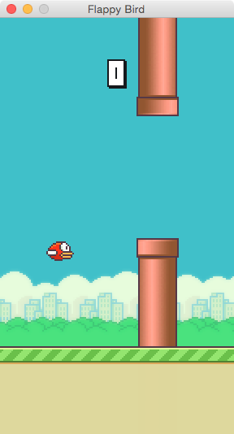

flappy-bird
------
An AI way of playing Flappy Bird using Q-Learning made using [python-pygame][1]

Algorithm
------
Q-Learning

    Q(S,A,gamma,alpha) 
        Variables
        	S is a set of states 
            A is a set of actions 
            gamma the discount 
            alpha is learning rate 
        Local
        	real array Q[S,A] 
            previous state s 
            previous action a 
        initialize Q[S,A] arbitrarily 
        observe current state s 
        repeat
            select and carry out an action a 
            observe reward r and next state s' 
            Q[s,a] = Q[s,a] + alpha(r + gamma(max(a' Q[s',a'] - Q[s,a])))
            s = s' until termination

How-to
------

1. Install Python 2.7.X from [here](https://www.python.org/download/releases/)

2. Install PyGame 1.9.X from [here](http://www.pygame.org/download.shtml)

3. Clone this repository: `git clone https://github.com/kv-kunalvyas/flappy-bird.git` or click `Download ZIP` in right panel and extract it.

4. Run `python flappy.py` from the repo's directory

5. This will start the project and the bird will start flying and will run indefinitely. It will respawn and start again if it dies. 

6. use <kbd>&uarr;</kbd> or <kbd>Space</kbd> key to play and <kbd>Esc</kbd> to manually close the game.

  (Note: Install pyGame for same version python as above)

  (For x64 windows, get exe [here](http://www.lfd.uci.edu/~gohlke/pythonlibs/#pygame))

ScreenShot
----------

[1]: http://www.pygame.org
